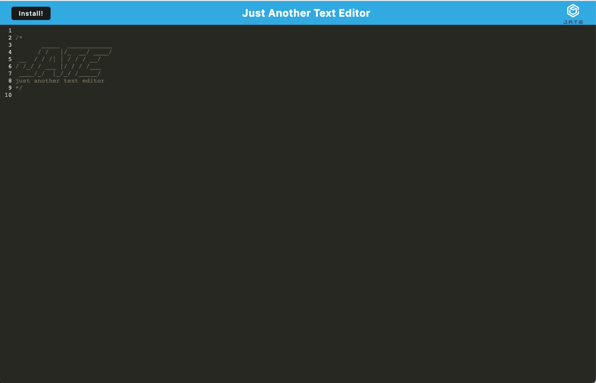

# <Just Another Text Editor>

## Description

In this project, the front end of the app needed to be completed by implementing IndexedDB, Webpack plugins, and service workers. While implementing those, I learned more about each of the topics and how they interact with each other. Using indexedDB, Webpack plugics and Service workers, I was able to allow the text editor to operate and persist data both online and offline.


## Installation

To install this application, run 
```
npm install
```
to get all the required packages, then you can run 

```
npm run start:dev
```
which will bundle all the files, create the dist folder to put the created files, and it will also start running the server.

You can also optionally install it on your computer by clicking on the install button when the application opens.


## Usage
To use this application locally, after following the installation commands, go to localhost:3000 and you can use this a a regular text editor. Additionally you can use the following link [JATE](https://radiant-mesa-13159.herokuapp.com/). This text editor can be used whether you're online or offline, and it will still persist your data, and any changed made to the file. To "save" your file you must click away from the text entered.

Here is an example of what the page will look like when it has loaded

   
